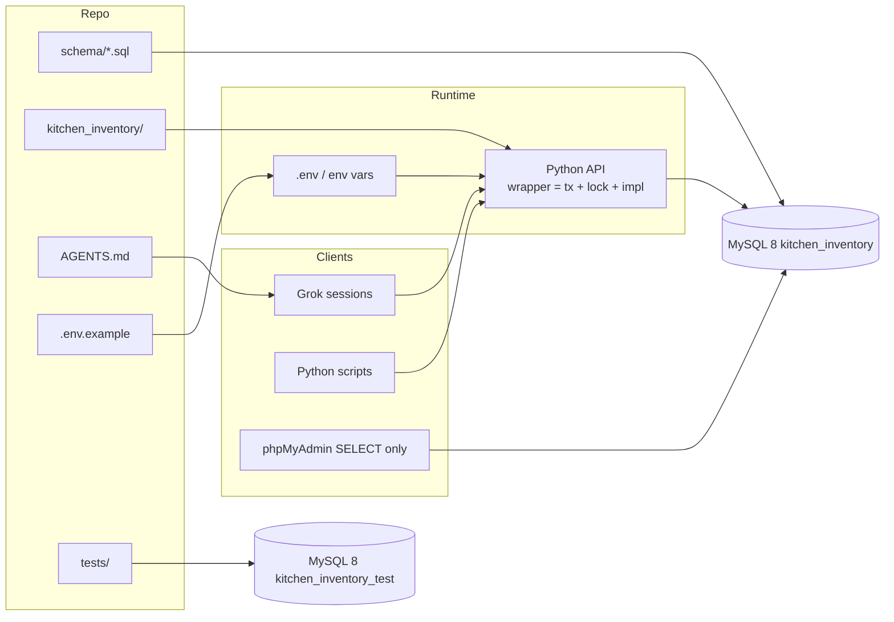
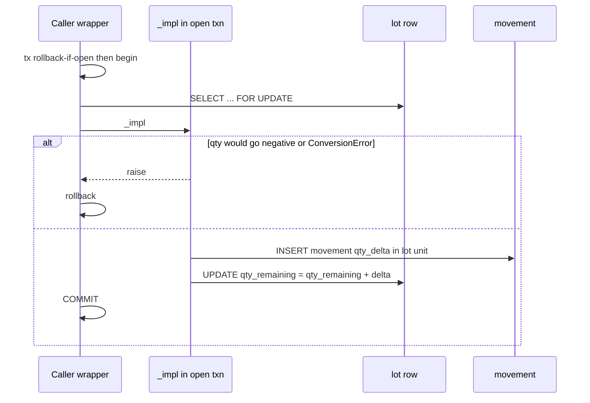
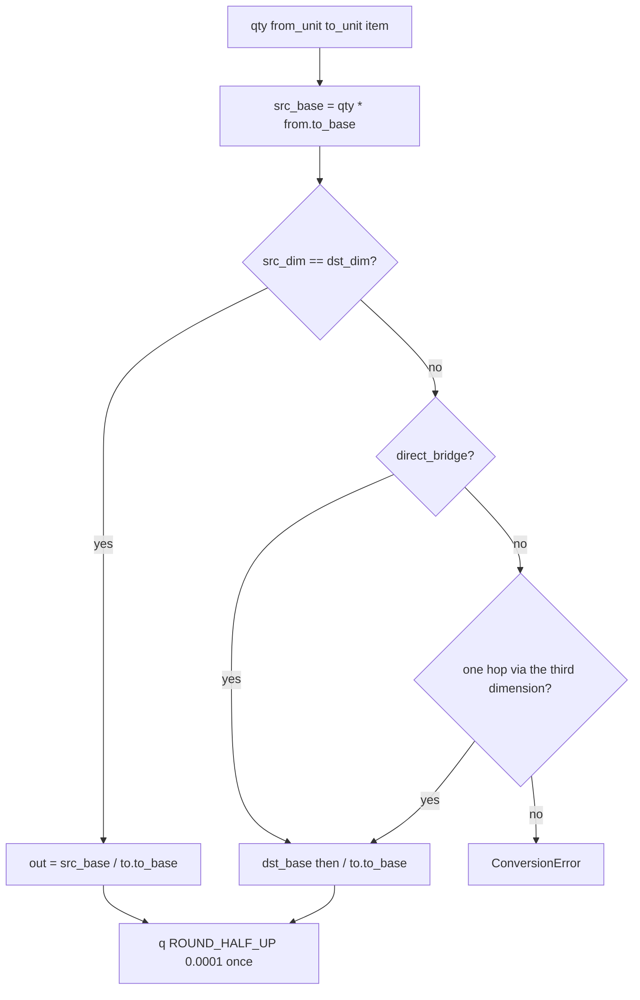

# Kitchen Inventory — MySQL Schema & Python/Grok Access

| Field | Value |
|---|---|
| **Status** | Approved |
| **Author** | TBD |
| **Date** | 2026-08-29 |
| **Version** | 0.4 |
| **Database** | `kitchen_inventory` @ `mysql.yourhost.name` |
| **Test database** | `kitchen_inventory_test` (pytest only; never mutators against live) |
| **App user** | `youruser` |
| **Clients** | this Grok session, other Grok sessions, local Python 3 scripts |
| **Non-client** | no web app in v1 (phpMyAdmin is the GUI) |

Connection shape (password never in git, never in this doc):

```bash
mysql -u youruser -p -h mysql.yourhost.name kitchen_inventory
```

Scale: one household; tens of lots active, low thousands historical; sub-10 QPS. Latency target: `cook_meal` < 200 ms on a cold-ish WAN to that host; on-hand SELECT is trivial.

---

## Overview

Greenfield household inventory: a **catalog of items** plus **physical lots** (bag of thighs, jar of sauce, leftover chili) that carry remaining quantity, location, and expiry. v1 is recipe- and meal-plan-centric — items exist to be cooked. The schema is a lot-grained ledger: every receive / consume / waste / adjust / transfer is a `movement` row, `lot.qty_remaining` is the operational on-hand, and Python is the only supported mutator.

The hard problem is **unit conversion**. Recipes speak cups; lots speak pounds. Conversion is a first-class hub (dimension bases `g` / `ml` / `each`, then item bridges) and **fails closed** when a factor is missing. Cooking a meal-plan row consumes lots FIFO by expiry, in **one** transaction, under a single `SELECT … FOR UPDATE` of candidate lots ordered by `lot.id`. `cook_meal` does not produce leftover lots; a subsequent `receive()` does.

---

## Background & Motivation

Workspace (`$HOME/kitchen-inventory` or wherever you clone) is empty at design time. The MySQL database already exists. Mutations and queries will be issued by humans and by Grok via Python; phpMyAdmin is available for inspection and one-off SELECTs, not for qty edits.

Pain if we under-design:

- On-hand that cannot be trusted after a week of cooking.
- Recipes that cannot be checked against inventory because “2 cups flour” cannot be compared to “5 lb bag.”
- Meal plans that do not consume lots, so the plan and the freezer diverge immediately.
- Other Grok sessions that cannot discover how to connect or what the tables mean.

Optimize for correctness, auditability, and phpMyAdmin-friendly relational shape. No tenants, no queues, no CQRS.

---

## Goals & Non-Goals

### Goals

- Lot-grained on-hand: remaining qty, location, expiry.
- Flat, extensible locations; seed freezer / pantry / fridge.
- Immutable-style movement ledger + denormalized `lot.qty_remaining` (dual-write in Python; **decided**, not an open question).
- Recipes as inventory consumption specs (not plated yield).
- Unit conversion with a single hub algorithm and explicit failure when factors are missing.
- Meal plan: date + slot + recipe + servings; cook = FIFO consume, all-or-nothing, one txn.
- Thin shopping-gap **query** (planned meals − on-hand). No shopping UX.
- Python 3 mutation/query API; env-based credentials; repo-discoverable schema.
- `AGENTS.md` so another Grok session can pick this up cold.
- pytest against `kitchen_inventory_test`, never the live household DB.

### Non-Goals (v1)

- Multi-household / auth system. `movement.actor` VARCHAR; default `MYSQL_ACTOR` or `"grok"`.
- Web/mobile UI.
- Nested locations, barcodes-as-identity (UPC is optional attribute).
- Ingredient substitutions, nutrition, costing (no cost columns in v1).
- Recipe yield / cooked-vs-dry conversions (rice 1:3). Ingredients are **as pulled from lots**. `cook_meal` never inserts an output lot.
- Trigger-maintained qty.
- Persisted shopping list with checkoff.
- `open_lot()` / opened-lot shorter shelf life. `lot.opened_at` is reserved, copied on split, unused by the API.
- Package-count units (`can`, `bunch`) as global aliases of `each`.

---

## Key Decisions

1. **Lot is the inventory grain.** Catalog (`item`) is the noun; `lot` is a physical package/batch with its own qty, location, expiry. Homemade leftovers are items; each batch is a lot. *Rationale:* matches how a kitchen actually spoils and moves food.

2. **Locations are a flat lookup, not a tree.** Seed `fridge`, `freezer`, `pantry`. Extensibility = `INSERT INTO location`. *Rationale:* confirmed product; nesting is unused complexity at household scale.

3. **Recipes are inventory consumption specs, not plated yield.** `recipe_ingredient.qty` is what disappears from lots at `default_servings`. Scale linearly by `planned_servings / default_servings`. `recipe.instructions` is a single `TEXT` column (no `recipe_step` table in v1). *Rationale:* cook path must hit lots; cooked-volume yield and stepped instructions are v1-out.

4. **`lot.qty_remaining` is operational SoT; `movement` is historical SoT. Dual-write in Python is the v1 decision, not an open question.** Every mutation writes both in one transaction. No triggers. `v_lot_ledger_drift` is the escape hatch. Physical count wins via `adjust`. *Rationale:* triggers + app dual-write double-applies; a SUM-from-ledger view is viable (Alt A) but the product asked for denormalized remaining. Changing this after lots exist is a data rewrite — do it only as a new KD, before PR 3 mutators land.

5. **Movements store signed `qty_delta` in the lot’s unit.** Conversion happens in Python before the INSERT. `lot.unit_id` is immutable after insert. *Rationale:* ledger arithmetic is `SUM(qty_delta)`; no mixed units in one lot’s history.

6. **Three dimensions; hub conversion; count globals are `each` and `dozen` only.** Reduce qty to dimension base (`g` / `ml` / `each` via `to_base_factor`) first; `direct_bridge` the three pairs (both directions); if that fails, one hop through the remaining dimension; then scale to the dest unit. Quantize **once** at the end (`Decimal.ROUND_HALF_UP`, `0.0001`). Missing bridge → `ConversionError`. Do **not** seed `can`/`bunch` (they would 1:1 convert as `each`). *Rationale:* fail-closed; dozen must not under-convert 12×; `can` as a global unit is a wrong-factor success; one-hop must not be a one-way example.

7. **US customary volume (cup = 236.5882365 ml), documented.** Not the 240 ml US legal cup, not the 250 ml metric cup. No `metric_cup` seed row in v1. *Rationale:* user-confirmed; changing `cup`’s factor under existing recipes is a data rewrite.

8. **FIFO consume: `expires_on IS NULL` last, then `expires_on ASC`, then `received_at ASC`, then `id`.** All locations eligible unless the caller passes a location filter. No thaw/preference logic. *Rationale:* expiry is the only confirmed ordering key.

9. **`cook_meal` is all-or-nothing in one txn, via non-committing `_impl` functions.** Public wrappers open `tx(conn)`. `cook_meal` must not call public `consume()`. Opaque lots are a **hard error at item grain** for `can_cook`, `cook_meal`, `on_hand_converted`, and `shopping_gap`: if any in-scope lot of the item fails `convert(..., item.default_unit)`, the item has **no numeric qty** (do not sum the convertible remainder). *Rationale:* wrapper-per-lot is a partial cook; a shopping gap of 0 plus a conversion error is a wrong dinner.

10. **Shopping gap is a query, not a table.** Demand coalesces by `item_id` after converting each ingredient line. No checkoff / persistence in v1. *Rationale:* user-confirmed; a checkoff UX is extra product.

11. **Lookups over MySQL ENUMs.** Python keys by `code` via allowlisted `code_id()`. Codes match `^[a-z][a-z0-9_]{0,31}$` enforced with `code COLLATE utf8mb4_0900_as_cs REGEXP …` (`CAST AS BINARY` is illegal with `utf8mb4_0900_ai_ci` — error 3995). Table collation stays `ai_ci` so `Fridge`/`fridge` still unique-collide. *Rationale:* phpMyAdmin can add a location; Grok does not hardcode autoincrement ids; unallowlisted table names are SQL injection.

12. **Python DB-API (PyMySQL + DictCursor), not an ORM.** Numbered SQL files, not Alembic. `pyproject.toml` src layout so `pip install -e .` makes `import kitchen_inventory` work. *Rationale:* Grok and a 30-year SQL user both want to read the SQL.

13. **Credentials via env / gitignored `.env` only.** Required: `MYSQL_HOST`, `MYSQL_USER`, `MYSQL_PASSWORD`, `MYSQL_DATABASE`. Optional: `MYSQL_PORT` (empty → 3306), `MYSQL_SSL` (default require TLS; `0` = explicit cleartext), `MYSQL_ACTOR` (default `"grok"`), `HOUSEHOLD_TZ` (IANA zone; example `America/New_York` — change to your location). Agents must not `read_file` / print `.env`. *Rationale:* WAN MySQL; multi-session Grok; secrets never committed.

14. **Single household, `ON DELETE RESTRICT` everywhere, no lot deletes.** Depleted lots stay at `qty_remaining = 0`. Archived items remain cookable while lots exist; `archived_at` only hides them from pickers if the caller filters. *Rationale:* ledger integrity.

15. **`expires_on` is `DATE`. Datetimes are naive UTC. “Today” is computed in Python from `HOUSEHOLD_TZ`.** Default example is `America/New_York`; set the IANA name for your household. Session `time_zone = '+00:00'`. Do not use `CURDATE()` in the Python API. `v_expiring` is phpMyAdmin sugar (UTC-date approximate) and is **not** the API. *Rationale:* expiry is a household calendar day.

16. **Require MySQL 8.0.16+ (not MariaDB) and `STRICT_TRANS_TABLES`.** `assert_server()` refuses MariaDB, `< 8.0.16`, and loose `sql_mode`. *Rationale:* CHECK enforcement, `utf8mb4_0900_ai_ci`, DECIMAL truncation.

17. **Default `actor` is `MYSQL_ACTOR` or `"grok"`.** Free string, no actor table. Wrappers that omit `actor` still write this default. *Rationale:* a NULL actor on every Grok cook makes the ledger unattributable.

18. **Same item may appear twice on a recipe** (surrogate PK on `recipe_ingredient`). Demand **sums after converting each line** to `item.default_unit`. `(name, brand)` unique with `brand DEFAULT ''`. Empty UPC → NULL in Python (`UNIQUE(upc)` would collide on `''`). *Rationale:* flour in dough + flour for dusting must not drop a line.

19. **`cook_meal` does not produce leftovers.** Output food is a later `receive()` of (usually) a new or existing leftover item. No cooked-yield conversion in v1. *Rationale:* user-confirmed; Grok must not invent an output lot.

20. **Lock order: `meal_plan` row, then all candidate lots `ORDER BY lot.id FOR UPDATE` in one statement.** Allocate FIFO in Python on the already-locked set. `connect()` sets `innodb_lock_wait_timeout = 5` (every wrapper, not only `cook_meal`). Map PyMySQL `OperationalError` 1205, 1213, and 3572 → `InvalidState("lock wait or deadlock")`. `consume()` / `adjust()` / `transfer()` lock **lot only** (never lots then `meal_plan`). *Rationale:* per-ingredient locking deadlocks two meals with opposite item order; deadlock is 1213, not 1205.

21. **Split copies identity timestamps.** Dest lot gets source `received_at`, `expires_on`, `opened_at`, `unit_id`, `item_id`. `qty is None` or `qty == qty_remaining` → whole-lot transfer (no new lot, `qty_delta = 0`). *Rationale:* new `received_at=now()` would FIFO-starve the remnant of the same package.

22. **`schema_migrations` has one writer: `migrate.apply()`.** SQL files do not INSERT those rows. phpMyAdmin first-time path inserts them by hand after `001`+`002`. Forward files are an **explicit allowlist** (`001_init.sql`, `002_seed.sql`). Emergency DROP lives at `schema/reset.sql` (no numeric prefix — it must not match a migrate glob). *Rationale:* two writers duplicate-PK `002`; a numbered `003_reset.sql` would DROP production on the next migrate.

23. **`updated_at` is `ON UPDATE CURRENT_TIMESTAMP(6)`.** Python does not maintain it. Dual-write of qty remains the only app-maintained denormalization. *Rationale:* forgetting `updated_at` on every qty UPDATE is the same class of bug as forgetting qty.

24. **pytest uses `MYSQL_DATABASE=kitchen_inventory_test` (or `MYSQL_TEST_DATABASE`).** Never run mutators against live `kitchen_inventory` in tests. *Rationale:* once real food is in the table, CI `receive`/`cook_meal` is data loss.

25. **Public mutators vs `_impl`.** Every write has `_foo_impl(conn, ...)` that assumes an open txn and held `FOR UPDATE` locks, plus a wrapper `with tx(conn): lock; impl`. Grok/scripts call wrappers only. *Rationale:* `cook_meal` composes `_consume_impl` without inner commits.

---

## Proposed Design

### Architecture



Write path is Python only. phpMyAdmin: SELECT, and INSERT into lookup tables (`location`). Do **not** UPDATE `lot.qty_remaining` or INSERT `movement` by hand. phpMyAdmin is cited as `http://mysql.yourhost.name/` — treat it as **not** a safe place to type `MYSQL_PASSWORD` (HTTP, unverified TLS).

### ER diagram

```mermaid
erDiagram
  DIMENSION ||--o{ UNIT : has
  UNIT ||--o{ ITEM : default_storage
  UNIT ||--o{ LOT : stored_in
  UNIT ||--o{ RECIPE_INGREDIENT : recipe_qty
  UNIT ||--o{ MOVEMENT : delta_unit
  LOCATION ||--o{ ITEM : default_putaway
  LOCATION ||--o{ LOT : holds
  LOCATION ||--o{ MOVEMENT : from_loc
  LOCATION ||--o{ MOVEMENT : to_loc
  ITEM ||--o{ LOT : packaged_as
  ITEM ||--o{ RECIPE_INGREDIENT : used_in
  LOT ||--o{ MOVEMENT : ledger
  MOVEMENT_TYPE ||--o{ MOVEMENT : classifies
  RECIPE ||--o{ RECIPE_INGREDIENT : contains
  RECIPE ||--o{ MEAL_PLAN : scheduled
  MEAL_SLOT ||--o{ MEAL_PLAN : slot
  MEAL_PLAN_STATUS ||--o{ MEAL_PLAN : status
  MEAL_PLAN ||--o{ MOVEMENT : cooked_as

  DIMENSION {
    tinyint unsigned id PK
    varchar code UK
    varchar name
  }
  UNIT {
    smallint unsigned id PK
    varchar code UK
    tinyint unsigned dimension_id FK
    decimal to_base_factor
  }
  LOCATION {
    smallint unsigned id PK
    varchar code UK
    varchar name
  }
  ITEM {
    bigint unsigned id PK
    varchar name
    varchar brand
    varchar upc
    smallint unsigned default_unit_id FK
    decimal density_g_per_ml
    decimal count_mass_g
    decimal count_volume_ml
  }
  LOT {
    bigint unsigned id PK
    bigint unsigned item_id FK
    smallint unsigned location_id FK
    smallint unsigned unit_id FK
    decimal qty_remaining
    date expires_on
    datetime received_at
  }
  MOVEMENT_TYPE {
    tinyint unsigned id PK
    varchar code UK
    tinyint qty_sign
  }
  MOVEMENT {
    bigint unsigned id PK
    bigint unsigned lot_id FK
    tinyint unsigned movement_type_id FK
    decimal qty_delta
    smallint unsigned unit_id FK
    bigint unsigned meal_plan_id FK
  }
  RECIPE {
    bigint unsigned id PK
    varchar name UK
    decimal default_servings
    text instructions
  }
  RECIPE_INGREDIENT {
    bigint unsigned id PK
    bigint unsigned recipe_id FK
    bigint unsigned item_id FK
    decimal qty
    smallint unsigned unit_id FK
  }
  MEAL_SLOT {
    tinyint unsigned id PK
    varchar code UK
  }
  MEAL_PLAN_STATUS {
    tinyint unsigned id PK
    varchar code UK
  }
  MEAL_PLAN {
    bigint unsigned id PK
    date plan_date
    tinyint unsigned meal_slot_id FK
    bigint unsigned recipe_id FK
    decimal planned_servings
    tinyint unsigned status_id FK
  }
```

### Consistency protocol (lots ↔ ledger)



Invariants (Python; CHECKs catch the cheap ones):

- `lot.qty_remaining >= 0`
- `lot.qty_remaining = SUM(movement.qty_delta)` for that `lot_id` after every committed API txn
- `movement.unit_id = lot.unit_id` always
- `lot.unit_id` never updated
- type `receive`: `qty_delta > 0`
- type `consume` / `waste`: `qty_delta < 0`
- type `adjust`: `qty_delta <> 0` (refuse no-ops)
- type `transfer` (whole lot): `qty_delta = 0`, both location ids set, `lot.location_id` updated
- type `split`: exactly two movements, shared `group_id`, `SUM(qty_delta)=0`; dest copies source timestamps
- `receive`/`consume`/`waste`/`split` magnitudes `qty > 0`; `adjust.new_qty >= 0`

No `AFTER INSERT` trigger on `movement` in v1. If we add one later, Python must **stop** updating `qty_remaining`.

Out-of-band phpMyAdmin qty edits are bugs. Fix with `adjust` (physical count).

### Unit conversion (hub)

Bases: mass=`g`, volume=`ml`, count=`each` (`dozen.to_base_factor = 12`).

`QUANT = Decimal('0.0001')`. `q(x) = x.quantize(QUANT, rounding=ROUND_HALF_UP)`. Python `decimal` default is `ROUND_HALF_EVEN` — **override**; do not use SQL `ROUND` in the API path. Do not use `float`.

```
convert(qty, from_unit, to_unit, item) -> Decimal
  1. src_base = qty * from_unit.to_base_factor          # now in g | ml | each
     src_dim  = from_unit.dimension.code
     dst_dim  = to_unit.dimension.code
  2. dst_base = bridge(src_base, src_dim, dst_dim, item)
  3. out = dst_base / to_unit.to_base_factor
  4. return q(out)                                      # ONE quantize
```

`direct_bridge(qty_base, src_dim, dst_dim, item)` — both directions of each pair, or `None`:

| Case | Rule |
|---|---|
| `src_dim == dst_dim` | identity |
| mass ↔ volume | require `density_g_per_ml`; `g = ml * density` |
| count ↔ mass | require `count_mass_g`; `g = each * count_mass_g` |
| count ↔ volume | `count_volume_ml` if set, else `count_mass_g / density_g_per_ml`; `ml = each * that` |
| otherwise | `None` |

`bridge(qty_base, src_dim, dst_dim, item)`:

1. `mid = direct_bridge(src_dim, dst_dim)` — if not `None`, return it.
2. Else exactly **one** intermediate: `third` is the unique dimension in `{mass, volume, count} - {src_dim, dst_dim}`. Compute `direct_bridge(src, third)` then `direct_bridge(third, dst)` using the same three factors. Either hop `None` → fail.
3. Else `ConversionError(item_id, from_code, to_code)`.

No other routes. At most one intermediate. `convert(a→b)` and `convert(b→a)` are the same function with swapped units — including the one-hop case (e.g. density + `count_volume_ml`, no `count_mass_g`: **both** `lb↔each` and `cup↔each`). Unit-test those four directions.

`count_*` factors are **per `each`**, never per `dozen`. `to_base_factor` already turned 1 dozen into 12 each before the bridge.



**When conversion is missing (opaque lot / missing density) — item grain, all four APIs:**

- Do **not** skip the lot. Do **not** fall through to a later FIFO lot. Do **not** sum the convertible remainder of the same item.
- Shared rule: if **any** in-scope lot of an item fails `convert(..., item.default_unit)`, that item has **no numeric qty** — only `ConversionIssue(lot_id=...)`. Applies to `can_cook`, `cook_meal`, `on_hand_converted`, and `shopping_gap`.
- `can_cook`: `ok=false`; item is in `conversion_errors`, not `shortages`.
- `shopping_gap`: item is in `conversion_errors` only, **never** in `gaps` (including `gap_qty=0`).
- `on_hand_converted`: omit **all** qty rows for that item (every location in the result), even if some locations converted.
- `cook_meal`: rollback the whole transaction even if later lots could cover demand.
- `recipe_ingredient.optional = 1` is omitted from demand only when `include_optional=False` (the default). Optional-but-unconvertible still errors if included. A demand-side convert failure (recipe unit → `default_unit`) is the same poison: no numeric gap.

`consume()` public API is **lot-unit only**. Cross-unit conversion lives in `cook_meal` / `can_cook` / `shopping_gap` / `on_hand_converted`. Only `cook_meal` then calls `_consume_impl` with the already-converted lot-unit qty.

Working unit for item-level demand/supply: **`item.default_unit`**. Each `recipe_ingredient` line is converted to that unit, then **summed by `item_id`**. Lots convert to the same unit.

#### Allocation (FIFO, after lots are locked)

Internal working qty uses the same `convert()` (already quantized to 4 dp). Crumbs: if `0 < need_work < QUANT`, treat as 0.

For each item, lots already locked, walk **FIFO sort in Python** (`expires_on is None`, `expires_on`, `received_at`, `id`) — not SQL order (SQL order was `id` for lock stability).

```
need_work = demand_in_default_unit
for lot in fifo(lots[item_id]):
    lot_work = convert(lot.qty_remaining, lot.unit, default_unit, item)
    take_work = min(lot_work, need_work)
    if take_work <= 0: continue
    take_lot = convert(take_work, default_unit, lot.unit, item)   # HALF_UP
    if take_lot > lot.qty_remaining:                             # cap = round-down path
        take_lot = lot.qty_remaining
    if take_lot <= 0: continue
    allocations.append((lot, take_lot))
    need_work -= convert(take_lot, lot.unit, default_unit, item)
    if need_work < QUANT: need_work = 0; break
if need_work > 0: InsufficientQty
```

Capping `take_lot` at `qty_remaining` is the round-down that protects `ck_lot_qty`. Subtract the **actual** take converted back, not `take_work`, so round-trip crumbs do not loop.

#### Worked examples

**Identity — 1 tbsp ↔ 3 tsp** (no item factor):

- `tsp.to_base = 4.9289215938`, `tbsp.to_base = 14.7867647813`
- `convert(3, tsp, tbsp) = q(3*4.9289215938/14.7867647813) = q(1.000000000007) = 1.0000`
- `convert(1, tbsp, tsp) = q(14.7867647813/4.9289215938) = q(2.99999999996) = 3.0000`

**Dozen vs each — 1 dozen eggs, recipe 2 each:**

- `to_base(1 dozen) = 12 each`. `convert(1, dozen, each) = 12.0000`
- `need_work = 2.0000 each`. `take_lot = convert(2, each, dozen) = q(2/12) = 0.1667 dozen`
- `0.1667 <= 1.0000`. Back-convert `0.1667*12 = 2.0004` → `need_work = 2.0000-2.0004` → clamp to 0. No false shortfall.

**2 cup flour vs 5 lb bag** with `density_g_per_ml` such that 1 cup = 120 g:

- `density = 120 / 236.5882365 = 0.5072103386`
- `2 cup → 473.176473 ml → 240.0000 g`
- `5 lb → 2267.9618500000 g` → `convert(5, lb, cup) = q(2267.96185/0.5072103386/236.5882365) ≈ 18.8997 cup`
- `take_work = 2.0000 cup`. `take_lot = convert(2, cup, lb) = q(240/453.59237) = 0.5291 lb`
- `0.5291 < 5`. Residual after back-convert is a crumb → 0. Cook succeeds; leftover lot `4.4709 lb`.

**Opaque lot:** flour lot stored in `each` (mis-received) with no `count_mass_g` / `count_volume_ml`. `convert(lot → cup)` raises. `can_cook.ok=false` with that `lot_id`. `cook_meal` rolls back even if a later `lb` bag would cover.

### FIFO cook

```mermaid
sequenceDiagram
  participant C as Caller
  participant W as cook_meal wrapper
  participant MP as meal_plan
  participant L as lot
  participant I as _consume_impl
  C->>W: cook_meal(meal_plan_id)
  W->>W: tx begin (lock_wait_timeout already 5 from connect)
  W->>MP: SELECT ... FOR UPDATE (status=planned)
  W->>W: load ingredients, scale, coalesce by item_id to default_unit
  W->>L: SELECT lots WHERE item_id IN (...) AND qty_remaining>0<br/>ORDER BY id FOR UPDATE
  W->>W: sort locked lots FIFO in Python; allocate
  alt ConversionError or shortfall or lock wait/deadlock 1205/1213
    W-->>C: rollback
  else
    loop each allocation
      W->>I: _consume_impl(conn, lot_id, take_lot, meal_plan_id) -- no commit
    end
    W->>MP: status=cooked, cooked_at=UTC now
    W->>W: COMMIT
  end
```

Test required: recipe with two flour lines; mid-allocation `ConversionError` (inject an opaque lot as earliest FIFO) leaves `COUNT(movement)=0` and `status=planned`.

### Bootstrap / server gate

Before DDL or API use:

```sql
SELECT VERSION() AS version,
       @@version_comment AS version_comment,
       @@sql_mode AS sql_mode,
       @@character_set_database AS db_charset,
       @@collation_database AS db_collation,
       @@have_ssl AS have_ssl,
       @@require_secure_transport AS require_secure_transport;
SELECT CURRENT_USER();
SHOW GRANTS;
```

`assert_server(conn)`:

- `VERSION()` contains `MariaDB` → refuse.
- Parse MySQL server version; refuse if `< 8.0.16`.
- `STRICT_TRANS_TABLES` not in `@@sql_mode` → refuse.
- Collation not `utf8mb4_0900_ai_ci` (or charset not `utf8mb4`) → **warn**, do not refuse (existing DB may differ; still `SET NAMES utf8mb4`).
- Returns `VERSION()` string.

Do not `CREATE DATABASE`. Session on every Python connection: `SET NAMES utf8mb4`, `SET time_zone = '+00:00'`, `SET SESSION innodb_lock_wait_timeout = 5`.

`ping_db.py`: `autocommit=True`; print version, sql_mode, `CURRENT_USER()`, `SHOW GRANTS`, lookup counts (`unit`, `location`), `have_ssl` / `require_secure_transport`. Makes missing `CREATE` obvious before migrate (OQ on grants remains).

---

## API / Interface Changes

Greenfield. Package: `kitchen_inventory` via src layout + `pyproject.toml`.

### Credentials

| Var | Required | Default |
|---|---|---|
| `MYSQL_HOST` | yes | — (`mysql.yourhost.name`) |
| `MYSQL_USER` | yes | — (`youruser`) |
| `MYSQL_PASSWORD` | yes | — (empty counts as missing) |
| `MYSQL_DATABASE` | yes | live: `kitchen_inventory`; pytest: `kitchen_inventory_test` |
| `MYSQL_PORT` | no | empty or unset → `3306` (`int("")` must not fire) |
| `MYSQL_SSL` | no | **unset or `1` → TLS required.** `0` → explicit cleartext (WARNING log, no password) |
| `MYSQL_ACTOR` | no | `"grok"` |
| `HOUSEHOLD_TZ` | no | Example `America/New_York` if unset. Change to your location. `expiring()` / `household_today()` use this. |
| `MYSQL_TEST_DATABASE` | pytest | `kitchen_inventory_test` if unset |

`.env` is gitignored. `.env.example` committed with empty password. `python-dotenv` loads `.env` if present; process env wins.

**Grok/agents: do not `read_file` `.env`, do not `cat .env`, do not paste `MYSQL_PASSWORD` into chat.** User exports vars or places `.env` themselves (`chmod 0600`; `connect()` does not chmod — it may not own the file). `connect()` never logs kwargs.

TLS: PyMySQL does not use TLS unless configured. `connect()` passes `ssl=True` unless `MYSQL_SSL=0`. Handshake failure with TLS on → raise; **no silent cleartext fallback**. If rollout probe shows the server has no TLS, set `MYSQL_SSL=0` and treat it as accepted risk (document in `AGENTS.md`). Until probed, default is require TLS.

### Connection helper

```python
# kitchen_inventory/db.py
LOOKUP_TABLES = frozenset({
    "dimension", "unit", "location", "movement_type",
    "meal_slot", "meal_plan_status",
})
V1_TABLES = frozenset({
    "schema_migrations", "dimension", "unit", "location", "movement_type",
    "meal_slot", "meal_plan_status", "item", "lot", "recipe",
    "recipe_ingredient", "meal_plan", "movement",
})

LOCK_ERRNOS = frozenset({1205, 1213, 3572})  # wait, deadlock, NOWAIT

def translate_lock(e: pymysql.err.OperationalError) -> None:
    """If e.args[0] in LOCK_ERRNOS: raise InvalidState("lock wait or deadlock") from e.
    Else re-raise."""

def connect(*, autocommit: bool = False) -> Connection:
    """Never log kwargs. ssl=True unless MYSQL_SSL=0.
    MYSQL_PORT empty/unset → 3306.
    SET SESSION innodb_lock_wait_timeout = 5 (all wrappers inherit this)."""

def assert_server(conn: Connection) -> str:
    """Refuse MariaDB, MySQL < 8.0.16, missing STRICT_TRANS_TABLES."""

def household_today() -> date:
    """Calendar date in HOUSEHOLD_TZ.
    tz = os.environ.get("HOUSEHOLD_TZ") or "America/New_York"
    ZoneInfoNotFoundError (bad IANA name) propagates.
    return datetime.now(ZoneInfo(tz)).date()
    """

def utcnow() -> datetime:
    """datetime.now(UTC).replace(tzinfo=None) — naive UTC for DATETIME(6)."""

def default_actor(actor: str | None) -> str:
    return actor or os.environ.get("MYSQL_ACTOR") or "grok"

@contextmanager
def tx(conn: Connection) -> Iterator[Connection]:
    """If a txn is already open, rollback first, then begin.
    commit on clean exit; rollback on exception."""

def code_id(conn, table: str, code: str) -> int:
    """Whitelist LOOKUP_TABLES; else ValueError.
    SELECT id FROM `{table}` WHERE code=%s. Cache key (table, code).
    Short-lived processes only — a long-running script will miss
    phpMyAdmin INSERT INTO location; restart or don't cache across hours."""

FORWARD_SQL = ("001_init.sql", "002_seed.sql")  # explicit allowlist; never glob

def migrate_apply(conn) -> None:
    """One writer of schema_migrations.
    For each name in FORWARD_SQL not already in the table:
      if name == '001_init.sql' and any V1_TABLE exists → refuse
        (tell operator to run schema/reset.sql by hand).
      execute schema/<name> (DDL may implicit-commit);
      INSERT schema_migrations (filename).
    Do not glob schema/*.sql or schema/00N_*.sql.
    schema/reset.sql is not in FORWARD_SQL and is never applied here."""
```

`tx()`: with `autocommit=False`, a previous failed caller can leave an implicit txn. Always `rollback()` then `begin()`. `ping_db.py` uses `connect(autocommit=True)`.

### Result types (`types.py`)

```python
@dataclass(frozen=True)
class ItemRow:
    id: int
    name: str
    brand: str
    upc: str | None
    default_unit_id: int
    default_location_id: int | None
    density_g_per_ml: Decimal | None
    count_mass_g: Decimal | None
    count_volume_ml: Decimal | None
    archived_at: datetime | None

@dataclass(frozen=True)
class RecipeIngredientSpec:
    item_id: int
    qty: Decimal
    unit_id: int
    optional: bool = False
    notes: str | None = None
    sort_order: int = 0

@dataclass(frozen=True)
class OnHandRow:
    item_id: int
    item_name: str
    brand: str
    location_id: int
    location_code: str
    unit_id: int
    unit_code: str
    qty: Decimal                    # SUM of lots in this native unit

@dataclass(frozen=True)
class LotRow:
    lot_id: int
    item_id: int
    item_name: str
    location_id: int
    location_code: str
    unit_id: int
    unit_code: str
    qty_remaining: Decimal
    expires_on: date | None
    received_at: datetime
    notes: str | None

@dataclass(frozen=True)
class Shortage:
    item_id: int
    item_name: str
    needed: Decimal
    available: Decimal
    unit_code: str                  # item.default_unit code

@dataclass(frozen=True)
class ConversionIssue:
    item_id: int
    item_name: str
    from_unit: str
    to_unit: str
    lot_id: int | None
    message: str

@dataclass(frozen=True)
class CanCookResult:
    ok: bool                        # shortages empty AND conversion_errors empty
    shortages: list[Shortage]
    conversion_errors: list[ConversionIssue]

@dataclass(frozen=True)
class Consumption:
    lot_id: int
    item_id: int
    qty_lot: Decimal                # magnitude in lot unit; movement stores −qty_lot
    unit_code: str

@dataclass(frozen=True)
class CookResult:
    meal_plan_id: int
    consumptions: list[Consumption]

@dataclass(frozen=True)
class GapRow:
    item_id: int
    item_name: str
    demand: Decimal
    on_hand: Decimal
    gap_qty: Decimal                # max(demand - on_hand, 0)
    unit_code: str                  # item.default_unit

@dataclass(frozen=True)
class ShoppingGapResult:
    gaps: list[GapRow]              # gap_qty > 0 only
    conversion_errors: list[ConversionIssue]

@dataclass(frozen=True)
class DriftRow:
    lot_id: int
    qty_remaining: Decimal
    ledger_qty: Decimal
    drift: Decimal
```

Exceptions: `InsufficientQty`, `ConversionError`, `InvalidState` — never `None` for failures.

### Operations — wrappers vs `_impl`

Grok/scripts call **wrappers only**. Wrappers: `with tx(conn):` lock rows `FOR UPDATE`, call `_impl`, commit. `_impl` functions do not `begin`/`commit` and assume locks are held.

`cook_meal` is a wrapper that locks once, then calls `_consume_impl` per allocation.

```python
def receive(..., actor: str | None = None) -> int:
    """qty > 0 required. INSERT lot (qty_remaining=qty) + _receive_impl movement.
    unit_id is the lot's immutable storage unit. opened_at left NULL (reserved).
    Returns lot.id."""

def consume(*, lot_id, qty: Decimal, movement_code: str = "consume",
            meal_plan_id: int | None = None, notes: str | None = None,
            actor: str | None = None) -> None:
    """qty > 0, lot-unit only. Wrapper: SELECT that lot FOR UPDATE then
    _consume_impl. Locks this lot only — never meal_plan (deadlock graph
    is meal_plan→lots vs lot-only). movement_code in {'consume','waste'}."""

def waste(...) -> None:
    """consume(..., movement_code='waste')."""

def adjust(*, lot_id, new_qty: Decimal, notes: str,
           actor: str | None = None) -> Decimal:
    """Physical count. notes is required (non-empty). new_qty >= 0.
    Locks this lot only. delta = new_qty - qty_remaining; refuse delta==0;
    returns delta."""

def transfer(*, lot_id, to_location_id, qty: Decimal | None = None,
             actor: str | None = None, notes: str | None = None) -> int:
    """qty is None or qty == qty_remaining → whole-lot transfer
    (qty_delta=0, update location_id, same lot.id).
    0 < qty < qty_remaining → split: dest lot copies
    item_id, unit_id, expires_on, received_at, opened_at, notes;
    dest.location_id = to_location_id; dest.qty_remaining = qty;
    two split movements, same group_id=uuid4, SUM(qty_delta)=0.
    qty <= 0 or qty > qty_remaining → InvalidState.
    Returns dest lot_id (same as source if whole-lot)."""

def upsert_item(*, name: str, brand: str = "", upc: str | None = None,
                default_unit_id: int, default_location_id: int | None = None,
                density_g_per_ml: Decimal | None = None,
                count_mass_g: Decimal | None = None,
                count_volume_ml: Decimal | None = None,
                notes: str | None = None) -> int:
    """Insert or update on UNIQUE(name, brand). upc '' → NULL. Returns id."""

def set_conversion_factors(*, item_id: int,
                           density_g_per_ml: Decimal | None = None,
                           count_mass_g: Decimal | None = None,
                           count_volume_ml: Decimal | None = None) -> None:
    """All three always written (None clears the factor)."""

def archive_item(*, item_id: int) -> None:
    """SET archived_at = utcnow(). Lots untouched. Still cookable."""

def add_recipe(*, name: str, default_servings: Decimal,
               instructions: str | None = None, notes: str | None = None) -> int: ...

def set_recipe_ingredients(*, recipe_id: int,
                           ingredients: Sequence[RecipeIngredientSpec]) -> None:
    """Replace-all in one txn: DELETE WHERE recipe_id=... then INSERT."""

def plan_meal(*, plan_date: date, meal_slot_code: str, recipe_id: int,
              planned_servings: Decimal, notes: str | None = None) -> int:
    """INSERT status=planned. Multiple recipes per date+slot allowed."""

def skip_meal(*, meal_plan_id: int, notes: str | None = None,
              actor: str | None = None) -> None:
    """planned → skipped only. No inventory. Refuse if cooked."""

def on_hand(*, location_id: int | None = None,
            item_id: int | None = None) -> list[OnHandRow]:
    """Native units, no conversion. v1 has no as_of."""

def on_hand_converted(*, location_id: int | None = None,
                      item_id: int | None = None) -> tuple[list[OnHandRow], list[ConversionIssue]]:
    """Same lot filter as on_hand. Convert each lot to item.default_unit.
    Item grain: if ANY in-scope lot of an item is opaque, emit no OnHandRow
    for that item (any location) — only ConversionIssue(lot_id=...) per
    failed lot. Fully convertible items: per-(item, location) rows in
    default_unit (location_id kept). Never return a partial qty next to
    a conversion error for the same item_id."""

def expiring(*, within_days: int = 7, include_expired: bool = True,
             location_id: int | None = None, today: date | None = None) -> list[LotRow]:
    """today defaults to household_today(). Predicate uses :today, not CURDATE()."""

def convert(qty: Decimal, from_unit_id: int, to_unit_id: int,
            item: ItemRow, units: UnitMap) -> Decimal:
    """Pure hub. Raises ConversionError."""

def can_cook(*, recipe_id: int, servings: Decimal,
             include_optional: bool = False,
             location_ids: Sequence[int] | None = None) -> CanCookResult:
    """Read-only, no locks. Coalesce ingredient lines by item_id after
    convert to default_unit. Opaque lot → conversion_errors, not skip."""

def cook_meal(*, meal_plan_id: int, include_optional: bool = False,
              location_ids: Sequence[int] | None = None,
              actor: str | None = None) -> CookResult:
    """One txn. Does NOT call consume() wrapper. Does NOT insert leftover lots.
    Lock meal_plan (zero rows or status≠planned → InvalidState);
    SELECT lots ... ORDER BY id FOR UPDATE; allocate FIFO in Python;
    _consume_impl per take; status=cooked, cooked_at=utcnow().
    Catch OperationalError via translate_lock (1205/1213/3572)."""

def shopping_gap(*, from_date: date, to_date: date,
                 include_optional: bool = False) -> ShoppingGapResult:
    """Read-only. Each ingredient line converted to default_unit, SUM by item_id
    for planned rows in [from,to]. Supply = on_hand_converted() (unfiltered).
    If the item is in conversion_errors (demand-side or any opaque on-hand
    lot), it is NOT in gaps — even when convertible lots would make
    gap_qty=0. No persistence."""

def reconcile_lots(conn) -> list[DriftRow]:
    """SELECT from v_lot_ledger_drift."""

def reconcile_splits(conn) -> list[dict]:
    """SELECT from v_split_drift. Must be empty."""
```

`can_cook` vs `cook_meal` TOCTOU: expected. `cook_meal` re-checks under locks. Two Grok sessions: row locks serialize; loser gets `InsufficientQty` or `InvalidState` (lock wait) and rollback.

---

## Data Model Changes

Greenfield. Apply in order against existing empty `kitchen_inventory`. Do not `CREATE DATABASE`. Do not `DROP` except via manual `schema/reset.sql`.

Conventions:

- Engine InnoDB, `utf8mb4`, `utf8mb4_0900_ai_ci`
- PK `id` unsigned integer, `AUTO_INCREMENT` except seed-id lookups
- FKs named `fk_<child>_<parent>`
- `created_at` `DATETIME(6) NOT NULL DEFAULT CURRENT_TIMESTAMP(6)`
- `updated_at` `DATETIME(6) NOT NULL DEFAULT CURRENT_TIMESTAMP(6) ON UPDATE CURRENT_TIMESTAMP(6)`
- Booleans: `TINYINT(1) NOT NULL DEFAULT 0`
- Lookup `code`: `VARCHAR(32) NOT NULL` + `CHECK (code COLLATE utf8mb4_0900_as_cs REGEXP '^[a-z][a-z0-9_]{0,31}$')` (as_cs so `Fridge` fails; `CAST AS BINARY` is error 3995 with this collation)
- Qty: `DECIMAL(12,4)`; factors: `DECIMAL(20,10)`

### Full DDL

`-- schema/001_init.sql`

```sql
-- kitchen_inventory v1 schema. Target: MySQL 8.0.16+ (not MariaDB).
-- Do NOT INSERT into schema_migrations from this file.
-- Apply only after assert_server() (or ping_db.py) succeeds.
-- mysql -u youruser -p -h mysql.yourhost.name kitchen_inventory < schema/001_init.sql

SET NAMES utf8mb4;
SET time_zone = '+00:00';

CREATE TABLE schema_migrations (
  filename   VARCHAR(128) NOT NULL,
  applied_at DATETIME(6)  NOT NULL DEFAULT CURRENT_TIMESTAMP(6),
  PRIMARY KEY (filename)
) ENGINE=InnoDB DEFAULT CHARSET=utf8mb4 COLLATE=utf8mb4_0900_ai_ci
  COMMENT='SQL file ledger; ONLY migrate.apply() inserts rows';

CREATE TABLE dimension (
  id         TINYINT UNSIGNED NOT NULL,
  code       VARCHAR(32)  NOT NULL,
  name       VARCHAR(64)  NOT NULL,
  si_symbol  VARCHAR(16)  NOT NULL COMMENT 'g | ml | 1',
  PRIMARY KEY (id),
  UNIQUE KEY uq_dimension_code (code),
  CONSTRAINT ck_dimension_code CHECK (code COLLATE utf8mb4_0900_as_cs REGEXP '^[a-z][a-z0-9_]{0,31}$')
) ENGINE=InnoDB DEFAULT CHARSET=utf8mb4 COLLATE=utf8mb4_0900_ai_ci;

CREATE TABLE unit (
  id              SMALLINT UNSIGNED NOT NULL AUTO_INCREMENT,
  code            VARCHAR(32)  NOT NULL COMMENT 'g, lb, cup, each, dozen',
  name            VARCHAR(64)  NOT NULL,
  dimension_id    TINYINT UNSIGNED NOT NULL,
  to_base_factor  DECIMAL(20,10) NOT NULL COMMENT 'multiply qty by this to get dimension base',
  sort_order      SMALLINT NOT NULL DEFAULT 0,
  is_metric       TINYINT(1) NOT NULL DEFAULT 1,
  PRIMARY KEY (id),
  UNIQUE KEY uq_unit_code (code),
  KEY idx_unit_dimension (dimension_id),
  CONSTRAINT fk_unit_dimension FOREIGN KEY (dimension_id) REFERENCES dimension (id)
    ON DELETE RESTRICT ON UPDATE RESTRICT,
  CONSTRAINT ck_unit_factor CHECK (to_base_factor > 0),
  CONSTRAINT ck_unit_code CHECK (code COLLATE utf8mb4_0900_as_cs REGEXP '^[a-z][a-z0-9_]{0,31}$')
) ENGINE=InnoDB DEFAULT CHARSET=utf8mb4 COLLATE=utf8mb4_0900_ai_ci;

CREATE TABLE location (
  id          SMALLINT UNSIGNED NOT NULL AUTO_INCREMENT,
  code        VARCHAR(32)  NOT NULL,
  name        VARCHAR(64)  NOT NULL,
  sort_order  SMALLINT NOT NULL DEFAULT 0,
  is_active   TINYINT(1) NOT NULL DEFAULT 1,
  created_at  DATETIME(6) NOT NULL DEFAULT CURRENT_TIMESTAMP(6),
  PRIMARY KEY (id),
  UNIQUE KEY uq_location_code (code),
  CONSTRAINT ck_location_code CHECK (code COLLATE utf8mb4_0900_as_cs REGEXP '^[a-z][a-z0-9_]{0,31}$')
) ENGINE=InnoDB DEFAULT CHARSET=utf8mb4 COLLATE=utf8mb4_0900_ai_ci;

CREATE TABLE movement_type (
  id        TINYINT UNSIGNED NOT NULL,
  code      VARCHAR(32) NOT NULL,
  name      VARCHAR(64) NOT NULL,
  qty_sign  TINYINT NOT NULL COMMENT '1 inbound, -1 outbound, 0 transfer-or-either',
  PRIMARY KEY (id),
  UNIQUE KEY uq_movement_type_code (code),
  CONSTRAINT ck_movement_type_sign CHECK (qty_sign IN (-1, 0, 1)),
  CONSTRAINT ck_movement_type_code CHECK (code COLLATE utf8mb4_0900_as_cs REGEXP '^[a-z][a-z0-9_]{0,31}$')
) ENGINE=InnoDB DEFAULT CHARSET=utf8mb4 COLLATE=utf8mb4_0900_ai_ci;

CREATE TABLE meal_slot (
  id          TINYINT UNSIGNED NOT NULL,
  code        VARCHAR(32) NOT NULL,
  name        VARCHAR(64) NOT NULL,
  sort_order  SMALLINT NOT NULL DEFAULT 0,
  PRIMARY KEY (id),
  UNIQUE KEY uq_meal_slot_code (code),
  CONSTRAINT ck_meal_slot_code CHECK (code COLLATE utf8mb4_0900_as_cs REGEXP '^[a-z][a-z0-9_]{0,31}$')
) ENGINE=InnoDB DEFAULT CHARSET=utf8mb4 COLLATE=utf8mb4_0900_ai_ci;

CREATE TABLE meal_plan_status (
  id    TINYINT UNSIGNED NOT NULL,
  code  VARCHAR(32) NOT NULL,
  name  VARCHAR(64) NOT NULL,
  PRIMARY KEY (id),
  UNIQUE KEY uq_meal_plan_status_code (code),
  CONSTRAINT ck_meal_plan_status_code CHECK (code COLLATE utf8mb4_0900_as_cs REGEXP '^[a-z][a-z0-9_]{0,31}$')
) ENGINE=InnoDB DEFAULT CHARSET=utf8mb4 COLLATE=utf8mb4_0900_ai_ci;

CREATE TABLE item (
  id                  BIGINT UNSIGNED NOT NULL AUTO_INCREMENT,
  name                VARCHAR(128) NOT NULL,
  brand               VARCHAR(128) NOT NULL DEFAULT '' COMMENT 'empty string = unbranded',
  upc                 VARCHAR(14)  NULL COMMENT 'GTIN-8/12/13/14; Python coerces empty to NULL',
  default_unit_id     SMALLINT UNSIGNED NOT NULL COMMENT 'canonical storage / gap / cook working unit',
  default_location_id SMALLINT UNSIGNED NULL,
  density_g_per_ml    DECIMAL(20,10) NULL COMMENT 'mass/volume bridge; water=1',
  count_mass_g        DECIMAL(20,10) NULL COMMENT 'grams per 1 each (count base)',
  count_volume_ml     DECIMAL(20,10) NULL COMMENT 'ml per 1 each',
  notes               VARCHAR(512) NULL,
  archived_at         DATETIME(6) NULL,
  created_at          DATETIME(6) NOT NULL DEFAULT CURRENT_TIMESTAMP(6),
  updated_at          DATETIME(6) NOT NULL DEFAULT CURRENT_TIMESTAMP(6) ON UPDATE CURRENT_TIMESTAMP(6),
  PRIMARY KEY (id),
  UNIQUE KEY uq_item_name_brand (name, brand),
  UNIQUE KEY uq_item_upc (upc),
  KEY idx_item_archived (archived_at),
  CONSTRAINT fk_item_default_unit FOREIGN KEY (default_unit_id) REFERENCES unit (id)
    ON DELETE RESTRICT ON UPDATE RESTRICT,
  CONSTRAINT fk_item_default_location FOREIGN KEY (default_location_id) REFERENCES location (id)
    ON DELETE RESTRICT ON UPDATE RESTRICT,
  CONSTRAINT ck_item_density CHECK (density_g_per_ml IS NULL OR density_g_per_ml > 0),
  CONSTRAINT ck_item_count_mass CHECK (count_mass_g IS NULL OR count_mass_g > 0),
  CONSTRAINT ck_item_count_vol CHECK (count_volume_ml IS NULL OR count_volume_ml > 0)
) ENGINE=InnoDB DEFAULT CHARSET=utf8mb4 COLLATE=utf8mb4_0900_ai_ci
  COMMENT='Catalog noun. Leftovers are items; batches are lots';

CREATE TABLE lot (
  id             BIGINT UNSIGNED NOT NULL AUTO_INCREMENT,
  item_id        BIGINT UNSIGNED NOT NULL,
  location_id    SMALLINT UNSIGNED NOT NULL,
  unit_id        SMALLINT UNSIGNED NOT NULL COMMENT 'immutable after insert',
  qty_remaining  DECIMAL(12,4) NOT NULL,
  expires_on     DATE NULL COMMENT 'use-by calendar day; NULL = unknown',
  received_at    DATETIME(6) NOT NULL DEFAULT CURRENT_TIMESTAMP(6),
  opened_at      DATETIME(6) NULL COMMENT 'reserved; unused by v1 API; copied on split',
  notes          VARCHAR(512) NULL,
  created_at     DATETIME(6) NOT NULL DEFAULT CURRENT_TIMESTAMP(6),
  updated_at     DATETIME(6) NOT NULL DEFAULT CURRENT_TIMESTAMP(6) ON UPDATE CURRENT_TIMESTAMP(6),
  PRIMARY KEY (id),
  KEY idx_lot_item_loc (item_id, location_id),
  KEY idx_lot_on_hand (item_id, qty_remaining, location_id),
  KEY idx_lot_expires (expires_on),
  KEY idx_lot_fifo (item_id, expires_on, received_at, id),
  KEY idx_lot_location (location_id),
  CONSTRAINT fk_lot_item FOREIGN KEY (item_id) REFERENCES item (id)
    ON DELETE RESTRICT ON UPDATE RESTRICT,
  CONSTRAINT fk_lot_location FOREIGN KEY (location_id) REFERENCES location (id)
    ON DELETE RESTRICT ON UPDATE RESTRICT,
  CONSTRAINT fk_lot_unit FOREIGN KEY (unit_id) REFERENCES unit (id)
    ON DELETE RESTRICT ON UPDATE RESTRICT,
  CONSTRAINT ck_lot_qty CHECK (qty_remaining >= 0)
) ENGINE=InnoDB DEFAULT CHARSET=utf8mb4 COLLATE=utf8mb4_0900_ai_ci
  COMMENT='Physical package/batch. Do not DELETE; deplete to 0';

CREATE TABLE recipe (
  id                BIGINT UNSIGNED NOT NULL AUTO_INCREMENT,
  name              VARCHAR(128) NOT NULL,
  default_servings  DECIMAL(6,2) NOT NULL,
  instructions      TEXT NULL COMMENT 'v1 single blob; no recipe_step table',
  notes             VARCHAR(512) NULL,
  archived_at       DATETIME(6) NULL,
  created_at        DATETIME(6) NOT NULL DEFAULT CURRENT_TIMESTAMP(6),
  updated_at        DATETIME(6) NOT NULL DEFAULT CURRENT_TIMESTAMP(6) ON UPDATE CURRENT_TIMESTAMP(6),
  PRIMARY KEY (id),
  UNIQUE KEY uq_recipe_name (name),
  CONSTRAINT ck_recipe_servings CHECK (default_servings > 0)
) ENGINE=InnoDB DEFAULT CHARSET=utf8mb4 COLLATE=utf8mb4_0900_ai_ci;

CREATE TABLE recipe_ingredient (
  id          BIGINT UNSIGNED NOT NULL AUTO_INCREMENT,
  recipe_id   BIGINT UNSIGNED NOT NULL,
  item_id     BIGINT UNSIGNED NOT NULL,
  qty         DECIMAL(12,4) NOT NULL COMMENT 'qty at recipe.default_servings, inventory consumption',
  unit_id     SMALLINT UNSIGNED NOT NULL,
  sort_order  SMALLINT NOT NULL DEFAULT 0,
  optional    TINYINT(1) NOT NULL DEFAULT 0,
  notes       VARCHAR(256) NULL,
  PRIMARY KEY (id),
  KEY idx_ri_recipe (recipe_id, sort_order),
  KEY idx_ri_item (item_id),
  CONSTRAINT fk_ri_recipe FOREIGN KEY (recipe_id) REFERENCES recipe (id)
    ON DELETE RESTRICT ON UPDATE RESTRICT,
  CONSTRAINT fk_ri_item FOREIGN KEY (item_id) REFERENCES item (id)
    ON DELETE RESTRICT ON UPDATE RESTRICT,
  CONSTRAINT fk_ri_unit FOREIGN KEY (unit_id) REFERENCES unit (id)
    ON DELETE RESTRICT ON UPDATE RESTRICT,
  CONSTRAINT ck_ri_qty CHECK (qty > 0)
) ENGINE=InnoDB DEFAULT CHARSET=utf8mb4 COLLATE=utf8mb4_0900_ai_ci;

CREATE TABLE meal_plan (
  id                BIGINT UNSIGNED NOT NULL AUTO_INCREMENT,
  plan_date         DATE NOT NULL,
  meal_slot_id      TINYINT UNSIGNED NOT NULL,
  recipe_id         BIGINT UNSIGNED NOT NULL,
  planned_servings  DECIMAL(6,2) NOT NULL,
  status_id         TINYINT UNSIGNED NOT NULL,
  cooked_at         DATETIME(6) NULL COMMENT 'Python: cooked <=> cooked_at IS NOT NULL; no DDL tautology',
  notes             VARCHAR(512) NULL,
  created_at        DATETIME(6) NOT NULL DEFAULT CURRENT_TIMESTAMP(6),
  updated_at        DATETIME(6) NOT NULL DEFAULT CURRENT_TIMESTAMP(6) ON UPDATE CURRENT_TIMESTAMP(6),
  PRIMARY KEY (id),
  KEY idx_mp_date_slot (plan_date, meal_slot_id),
  KEY idx_mp_status_date (status_id, plan_date),
  KEY idx_mp_recipe (recipe_id),
  CONSTRAINT fk_mp_slot FOREIGN KEY (meal_slot_id) REFERENCES meal_slot (id)
    ON DELETE RESTRICT ON UPDATE RESTRICT,
  CONSTRAINT fk_mp_recipe FOREIGN KEY (recipe_id) REFERENCES recipe (id)
    ON DELETE RESTRICT ON UPDATE RESTRICT,
  CONSTRAINT fk_mp_status FOREIGN KEY (status_id) REFERENCES meal_plan_status (id)
    ON DELETE RESTRICT ON UPDATE RESTRICT,
  CONSTRAINT ck_mp_servings CHECK (planned_servings > 0)
) ENGINE=InnoDB DEFAULT CHARSET=utf8mb4 COLLATE=utf8mb4_0900_ai_ci
  COMMENT='Multiple recipes per date+slot allowed (main + side)';

CREATE TABLE movement (
  id                 BIGINT UNSIGNED NOT NULL AUTO_INCREMENT,
  lot_id             BIGINT UNSIGNED NOT NULL,
  movement_type_id   TINYINT UNSIGNED NOT NULL,
  qty_delta          DECIMAL(12,4) NOT NULL COMMENT 'signed, in lot.unit_id',
  unit_id            SMALLINT UNSIGNED NOT NULL COMMENT 'must equal lot.unit_id',
  from_location_id   SMALLINT UNSIGNED NULL,
  to_location_id     SMALLINT UNSIGNED NULL,
  meal_plan_id       BIGINT UNSIGNED NULL,
  group_id           CHAR(36) NULL COMMENT 'uuid linking split pair',
  actor              VARCHAR(64) NULL,
  occurred_at        DATETIME(6) NOT NULL DEFAULT CURRENT_TIMESTAMP(6),
  notes              VARCHAR(512) NULL,
  created_at         DATETIME(6) NOT NULL DEFAULT CURRENT_TIMESTAMP(6),
  PRIMARY KEY (id),
  KEY idx_mov_lot_time (lot_id, occurred_at),
  KEY idx_mov_type_time (movement_type_id, occurred_at),
  KEY idx_mov_meal (meal_plan_id),
  KEY idx_mov_group (group_id),
  KEY idx_mov_occurred (occurred_at),
  CONSTRAINT fk_mov_lot FOREIGN KEY (lot_id) REFERENCES lot (id)
    ON DELETE RESTRICT ON UPDATE RESTRICT,
  CONSTRAINT fk_mov_type FOREIGN KEY (movement_type_id) REFERENCES movement_type (id)
    ON DELETE RESTRICT ON UPDATE RESTRICT,
  CONSTRAINT fk_mov_unit FOREIGN KEY (unit_id) REFERENCES unit (id)
    ON DELETE RESTRICT ON UPDATE RESTRICT,
  CONSTRAINT fk_mov_from_loc FOREIGN KEY (from_location_id) REFERENCES location (id)
    ON DELETE RESTRICT ON UPDATE RESTRICT,
  CONSTRAINT fk_mov_to_loc FOREIGN KEY (to_location_id) REFERENCES location (id)
    ON DELETE RESTRICT ON UPDATE RESTRICT,
  CONSTRAINT fk_mov_meal FOREIGN KEY (meal_plan_id) REFERENCES meal_plan (id)
    ON DELETE RESTRICT ON UPDATE RESTRICT
) ENGINE=InnoDB DEFAULT CHARSET=utf8mb4 COLLATE=utf8mb4_0900_ai_ci
  COMMENT='Append-mostly ledger. Do not UPDATE qty_delta';

CREATE VIEW v_on_hand AS
SELECT
  lot.id              AS lot_id,
  lot.item_id,
  item.name           AS item_name,
  item.brand,
  lot.location_id,
  location.code       AS location_code,
  location.name       AS location_name,
  lot.unit_id,
  unit.code           AS unit_code,
  unit.dimension_id,
  lot.qty_remaining,
  lot.expires_on,
  lot.received_at,
  lot.opened_at,
  lot.notes
FROM lot
JOIN item     ON item.id = lot.item_id
JOIN location ON location.id = lot.location_id
JOIN unit     ON unit.id = lot.unit_id
WHERE lot.qty_remaining > 0;

-- phpMyAdmin sugar only. Uses session CURDATE() (UTC under our connections).
-- Not the Python API; not parameterized (within_days). Do not treat as source of truth near local midnight.
CREATE VIEW v_expiring AS
SELECT *
FROM v_on_hand
WHERE expires_on IS NOT NULL
  AND expires_on <= (CURDATE() + INTERVAL 7 DAY);

CREATE VIEW v_lot_ledger AS
SELECT
  lot.id AS lot_id,
  lot.qty_remaining,
  COALESCE(SUM(movement.qty_delta), 0) AS ledger_qty,
  lot.qty_remaining - COALESCE(SUM(movement.qty_delta), 0) AS drift
FROM lot
LEFT JOIN movement ON movement.lot_id = lot.id
GROUP BY lot.id, lot.qty_remaining;

CREATE VIEW v_lot_ledger_drift AS
SELECT *
FROM v_lot_ledger
WHERE drift <> 0;

CREATE VIEW v_split_drift AS
SELECT
  movement.group_id,
  SUM(movement.qty_delta) AS qty_sum,
  COUNT(*) AS n
FROM movement
JOIN movement_type ON movement_type.id = movement.movement_type_id
WHERE movement_type.code = 'split'
  AND movement.group_id IS NOT NULL
GROUP BY movement.group_id
HAVING SUM(movement.qty_delta) <> 0 OR COUNT(*) <> 2;
```

`-- schema/002_seed.sql` — **no** `INSERT INTO schema_migrations`.

```sql
SET NAMES utf8mb4;

INSERT INTO dimension (id, code, name, si_symbol) VALUES
  (1, 'mass',   'Mass',   'g'),
  (2, 'volume', 'Volume', 'ml'),
  (3, 'count',  'Count',  '1');

INSERT INTO unit (code, name, dimension_id, to_base_factor, sort_order, is_metric) VALUES
  ('g',     'gram',          1, 1.0000000000,     10, 1),
  ('kg',    'kilogram',      1, 1000.0000000000,  20, 1),
  ('oz',    'ounce',         1, 28.3495231250,    30, 0),
  ('lb',    'pound',         1, 453.5923700000,   40, 0),
  -- Volume base = millilitre. US customary (not US legal cup 240, not metric 250).
  ('ml',    'millilitre',    2, 1.0000000000,     10, 1),
  ('l',     'litre',         2, 1000.0000000000,  20, 1),
  ('tsp',   'teaspoon',      2, 4.9289215938,     30, 0),
  ('tbsp',  'tablespoon',    2, 14.7867647813,    40, 0),
  ('fl_oz', 'fluid ounce',   2, 29.5735295625,    50, 0),
  ('cup',   'cup (US)',      2, 236.5882365000,   60, 0),
  ('pint',  'pint (US)',     2, 473.1764730000,   70, 0),
  ('quart', 'quart (US)',    2, 946.3529460000,   80, 0),
  ('gallon','gallon (US)',   2, 3785.4117840000,  90, 0),
  -- Count base = each. dozen is the only global scale. No can/bunch (would 1:1 as each).
  ('each',  'each',          3, 1.0000000000,     10, 1),
  ('dozen', 'dozen',         3, 12.0000000000,    20, 1);

INSERT INTO location (code, name, sort_order) VALUES
  ('fridge',  'Fridge',  10),
  ('freezer', 'Freezer', 20),
  ('pantry',  'Pantry',  30);

INSERT INTO movement_type (id, code, name, qty_sign) VALUES
  (1, 'receive',  'Receive',  1),
  (2, 'consume',  'Consume', -1),
  (3, 'waste',    'Waste',   -1),
  (4, 'adjust',   'Adjust',   0),
  (5, 'transfer', 'Transfer', 0),
  (6, 'split',    'Split',    0);

INSERT INTO meal_slot (id, code, name, sort_order) VALUES
  (1, 'breakfast', 'Breakfast', 10),
  (2, 'lunch',     'Lunch',     20),
  (3, 'dinner',    'Dinner',    30),
  (4, 'snack',     'Snack',     40);

INSERT INTO meal_plan_status (id, code, name) VALUES
  (1, 'planned', 'Planned'),
  (2, 'cooked',  'Cooked'),
  (3, 'skipped', 'Skipped');
```

`-- schema/reset.sql` — **not** in `FORWARD_SQL`, **not** applied by `migrate.apply()`. No numeric prefix (must not match `[0-9][0-9][0-9]_*.sql` if someone globs anyway). Emergency only:

```sql
-- EMERGENCY RESET. Drops all v1 objects. Not run by migrate.
-- Use when 001_init.sql failed mid-file (half schema, no schema_migrations row).
-- mysql -u youruser -p -h mysql.yourhost.name kitchen_inventory < schema/reset.sql
SET FOREIGN_KEY_CHECKS = 0;
DROP VIEW IF EXISTS v_split_drift;
DROP VIEW IF EXISTS v_lot_ledger_drift;
DROP VIEW IF EXISTS v_lot_ledger;
DROP VIEW IF EXISTS v_expiring;
DROP VIEW IF EXISTS v_on_hand;
DROP TABLE IF EXISTS movement;
DROP TABLE IF EXISTS meal_plan;
DROP TABLE IF EXISTS recipe_ingredient;
DROP TABLE IF EXISTS recipe;
DROP TABLE IF EXISTS lot;
DROP TABLE IF EXISTS item;
DROP TABLE IF EXISTS meal_plan_status;
DROP TABLE IF EXISTS meal_slot;
DROP TABLE IF EXISTS movement_type;
DROP TABLE IF EXISTS location;
DROP TABLE IF EXISTS unit;
DROP TABLE IF EXISTS dimension;
DROP TABLE IF EXISTS schema_migrations;
SET FOREIGN_KEY_CHECKS = 1;
```

Seed does **not** insert items, recipes, or lots. Do **not** use `CREATE TABLE IF NOT EXISTS` (hides drift).

### Migration strategy

- Forward files are the allowlist `FORWARD_SQL = ("001_init.sql", "002_seed.sql")`. Do not glob. `schema/reset.sql` has no numeric prefix and is never auto-applied.
- **Only** `migrate.apply()` INSERTs `schema_migrations`.
- phpMyAdmin first-time path (document in `AGENTS.md`):

```sql
-- after successfully sourcing 001_init.sql then 002_seed.sql:
INSERT INTO schema_migrations (filename) VALUES
  ('001_init.sql'),
  ('002_seed.sql');
```

- If `001` fails mid-file: run `schema/reset.sql` by hand, then retry migrate. `migrate.apply()` **refuses** if any `V1_TABLES` row exists in `information_schema` and `001_init.sql` is unrecorded.
- No down-migrations. Forward-fix by appending to `FORWARD_SQL` (e.g. `004_*.sql`) — still never `reset.sql`.
- DDL implicit-commit: still INSERT the filename only after that file’s statements succeeded.

### Indexes vs expected queries

| Query | Uses |
|---|---|
| on-hand by location | `idx_lot_on_hand` / `v_on_hand` |
| lock all cook lots | `PRIMARY` (`ORDER BY id FOR UPDATE`); FIFO sort is Python |
| expiring (API) | `idx_lot_expires` |
| ledger by lot | `idx_mov_lot_time` |
| meal plan week | `idx_mp_date_slot` |
| what did this meal consume | `idx_mov_meal` |

`idx_lot_fifo (item_id, expires_on, received_at, id)` does **not** match `ORDER BY expires_on IS NULL, …` (MySQL NULLS-first vs our nulls-last). Irrelevant at tens of active lots; FIFO walk is in Python on an already-locked set. Views are phpMyAdmin sugar and do not match API parameters (`within_days`, `:today`).

---

## Key query sketches

### On-hand by location (native units — no conversion)

```sql
SELECT
  location.code AS location_code,
  item.id       AS item_id,
  item.name     AS item_name,
  unit.code     AS unit_code,
  SUM(lot.qty_remaining) AS qty
FROM lot
JOIN item     ON item.id = lot.item_id
JOIN location ON location.id = lot.location_id
JOIN unit     ON unit.id = lot.unit_id
WHERE lot.qty_remaining > 0
  AND (:location_id IS NULL OR lot.location_id = :location_id)
  AND (:item_id IS NULL OR lot.item_id = :item_id)
GROUP BY location.code, item.id, item.name, unit.code
ORDER BY location.code, item.name, unit.code;
```

Same item in `lb` and `oz` → two rows. `on_hand_converted()` merges via `convert(...)` to `item.default_unit_id`.

### Expiring / expired lots

Python API — bind household today, never `CURDATE()`:

```sql
SELECT
  lot.id, item.name, location.code, lot.qty_remaining, unit.code,
  lot.expires_on,
  DATEDIFF(lot.expires_on, :today) AS days_until
FROM lot
JOIN item     ON item.id = lot.item_id
JOIN location ON location.id = lot.location_id
JOIN unit     ON unit.id = lot.unit_id
WHERE lot.qty_remaining > 0
  AND lot.expires_on IS NOT NULL
  AND lot.expires_on <= DATE_ADD(:today, INTERVAL :within_days DAY)
  AND (:include_expired = 1 OR lot.expires_on >= :today)
ORDER BY lot.expires_on, item.name, lot.id;
```

### Can I cook this recipe?

SQL fetches **lines** (no `GROUP BY item_id` — coalescing is Python after convert):

```sql
SELECT
  ri.id AS recipe_ingredient_id,
  ri.item_id,
  item.name,
  item.default_unit_id,
  item.density_g_per_ml,
  item.count_mass_g,
  item.count_volume_ml,
  ri.qty * (:servings / recipe.default_servings) AS needed_qty,
  ri.unit_id AS needed_unit_id,
  ri.optional
FROM recipe_ingredient ri
JOIN recipe ON recipe.id = ri.recipe_id
JOIN item   ON item.id = ri.item_id
WHERE ri.recipe_id = :recipe_id
  AND (:include_optional = 1 OR ri.optional = 0);

-- lock set for cook_meal (stable order). can_cook omits FOR UPDATE.
SELECT lot.id, lot.item_id, lot.qty_remaining, lot.unit_id,
       lot.location_id, lot.expires_on, lot.received_at
FROM lot
WHERE lot.qty_remaining > 0
  AND lot.item_id IN (/* demand item_ids */)
  AND (:location_ids IS NULL OR lot.location_id IN (/* ... */))
ORDER BY lot.id
FOR UPDATE;
```

Python:

1. For each ingredient **line**, `convert(needed_qty, needed_unit, item.default_unit, item)` then `SUM` by `item_id`. Two flour lines (dough + dusting) both add.
2. For each locked lot, `convert` to `default_unit`. Any `ConversionError` → `conversion_errors` (include `lot_id`); do not skip.
3. Shortage if `available < needed` after summing convertible lots **only when there were no conversion errors for that item**. If any lot for the item is opaque, the item is an error, not a numeric gap.
4. `ok = not shortages and not conversion_errors`.

### Meal-plan shopping gap

Pull **ungrouped** lines (or grouped only by `recipe_ingredient` identity). Convert each scaled line to `item.default_unit` in Python, `SUM` by `item_id`. Do **not** `GROUP BY ri.unit_id` and then add.

Supply = `on_hand_converted()` (all locations). For each `item_id`: if that item appears in `conversion_errors` (opaque on-hand lot **or** demand line that cannot convert to `default_unit`), emit **only** the error(s) — do not emit a `GapRow`, including `gap_qty=0`. Else `gap_qty = max(demand - supply, 0)` and omit zeros. Same mixed `lb`+`each` flour case as `can_cook`: `can_cook.ok=false`, `gaps=[]`, error includes `lot_id`.

### Reconcile

```sql
SELECT * FROM v_lot_ledger_drift;
SELECT * FROM v_split_drift;
```

Both must be empty after every API-only workload.

---

## Python module surface (layout)

```
KitchenInventory/
  .gitignore
  .env.example
  pyproject.toml            # required: packages from src/; pytest config
  requirements.txt          # PyMySQL, python-dotenv, cryptography, pytest
  AGENTS.md
  schema/
    001_init.sql
    002_seed.sql
    reset.sql               # emergency DROP; no numeric prefix; never auto-applied
  src/kitchen_inventory/
    __init__.py             # re-export public wrappers only (not _impl)
    db.py                   # connect, tx, assert_server, code_id, migrate
    types.py
    errors.py
    units.py
    lots.py                 # wrappers + _receive_impl, _consume_impl, ...
    queries.py
    recipes.py
    meals.py
  tests/
    test_units.py           # no DB: tbsp/tsp, dozen/each, flour cup↔lb, opaque,
                            # density+count_volume_ml lb↔each and cup↔each both ways
    test_lots.py            # integration vs kitchen_inventory_test
    test_cook.py            # dual-write, two flour lines, opaque rollback, split FIFO,
                            # mixed lb+each flour: can_cook.ok=false, shopping_gap empty gaps
  scripts/
    ping_db.py
```

`pip install -e .` from `pyproject.toml`:

```toml
[project]
name = "kitchen-inventory"
version = "0.1.0"
requires-python = ">=3.11"
dependencies = ["PyMySQL>=1.1.0", "python-dotenv>=1.0.0", "cryptography"]

[project.optional-dependencies]
dev = ["pytest>=8.0"]

[build-system]
requires = ["setuptools>=68"]
build-backend = "setuptools.build_meta"

[tool.setuptools.packages.find]
where = ["src"]

[tool.pytest.ini_options]
testpaths = ["tests"]
```

`cryptography` is required for MySQL 8 `caching_sha2_password`. Integration tests skip unless `MYSQL_PASSWORD` is set **and** `MYSQL_DATABASE`/`MYSQL_TEST_DATABASE` is `kitchen_inventory_test` (refuse to run mutator tests if the name is `kitchen_inventory`).

---

## Credential handling & Grok discovery

### Secrets

- `.gitignore`: `.env`, `.venv/`, `__pycache__/`, `*.pyc`, `.python-version`
- `.env.example`:

```
MYSQL_HOST=mysql.yourhost.name
MYSQL_USER=youruser
MYSQL_PASSWORD=
MYSQL_DATABASE=kitchen_inventory
MYSQL_PORT=3306
MYSQL_SSL=1
MYSQL_ACTOR=grok
# IANA zone for expiry "today". Change to your location.
HOUSEHOLD_TZ=America/New_York
# MYSQL_TEST_DATABASE=kitchen_inventory_test
```

- User creates `.env` and `chmod 0600`. Agents do not create or read it.
- Password supplied later by the user. Until then `connect()` fails with `missing env`.
- Do not use `~/.my.cnf` as the primary path.

### What another Grok session reads first

1. `AGENTS.md` — conventions, table cheat sheet, env vars, dual-write, “do not edit lot qty,” “do not read `.env`,” “do not paste MYSQL_PASSWORD.”
2. `schema/001_init.sql` + `schema/002_seed.sql` (`schema/reset.sql` is emergency DROP only — never migrate it)
3. `src/kitchen_inventory/` — wrappers vs `_impl`
4. This design doc if copied under `docs/`

---

## Alternatives Considered

### A. Ledger-only on-hand (`qty_remaining` as a VIEW of `SUM(qty_delta)`)

- **Pros:** impossible to drift; one write.
- **Cons:** phpMyAdmin users stare at a view; product asked for denormalized remaining.
- **Trade-off:** rejected for v1. KD 4 is closed. Revisit only if `v_lot_ledger_drift` is non-empty in the wild, as a new migration, not a parallel open question.

### B. Triggers maintain `qty_remaining` from movements

- **Pros:** phpMyAdmin-inserted movements would update qty.
- **Cons:** double-apply if Python also updates; Grok cannot see the write path; transfer/split still need `location_id` updates.
- **Trade-off:** rejected for v1. If added later, remove the Python qty UPDATE in the same PR.

### C. Store all lot qty in dimension-base units (g / ml / each)

- **Pros:** conversion at the edge only.
- **Cons:** phpMyAdmin shows `2267.9618 g` instead of `5 lb`.
- **Trade-off:** rejected. Store what is on the package.

### D. General `item_conversion(item_id, from_unit_id, to_unit_id, factor)`

- **Pros:** “1 can = 411 g” as a row without poisoning the global `unit` table.
- **Cons:** more join surface; product asked for density + count-to-mass columns.
- **Trade-off:** v1 uses the three columns **and** does not seed `can`/`bunch`. A can of tomatoes is `each` + `count_mass_g`. Add `item_conversion` later without dropping the columns.

### E. ORM (SQLAlchemy) + Alembic

- **Pros:** typed models.
- **Cons:** ledger rules hidden in ORM events.
- **Trade-off:** rejected. Numbered SQL + PyMySQL.

---

## Security & Privacy Considerations

| Threat | Severity | Mitigation |
|---|---|---|
| Password in git / chat / `AGENTS.md` / agent `read_file .env` | High | gitignored `.env`; agents must not open it; never echo |
| WAN MySQL sniffed | High | `connect()` requires TLS unless `MYSQL_SSL=0` (explicit accepted risk). Never log kwargs. phpMyAdmin `http://` is not a safe password entry |
| phpMyAdmin as a write backdoor | Medium | convention + drift views |
| SQL injection via `code_id(table)` | High | allowlist `LOOKUP_TABLES`; `ValueError` otherwise; `code` is a bound param |
| Concurrent double-consume / deadlock | Medium | lots `ORDER BY id FOR UPDATE`; 1205/1213/3572 → `InvalidState`; lot-only wrappers never lock meal_plan |
| Destructive `DROP` in migrate | High | no DROP in `001`/`002`; `schema/reset.sql` has no numeric prefix and is not in `FORWARD_SQL` |
| Tests mutating live food data | High | refuse mutator tests unless DB name is `kitchen_inventory_test` |
| PII | Low | no user table; `actor` is a short label |

AuthZ: single MySQL user. Host firewall / grants are out of band (`ping_db` prints `SHOW GRANTS`).

---

## Observability

- **Logging:** `kitchen_inventory` logger. Mutations `INFO` `{op, lot_id, item_id, qty_delta, movement_type, actor, meal_plan_id}` — never password, never connect kwargs. `MYSQL_SSL=0` → `WARNING`. `ConversionError` / `InsufficientQty` / lock wait → `WARNING`.
- **Metrics:** none in v1.
- **Alerting:** none. Drift queries: `v_lot_ledger_drift`, `v_split_drift`.
- **phpMyAdmin:** `v_on_hand` (real), `v_expiring` (UTC-date approximate), drift views.

---

## Rollout Plan

No feature flags. Staged by PR.

1. **Probe the live server before any DDL:** `ping_db.py` / manual `SELECT VERSION()`, `@@sql_mode`, `have_ssl`, `require_secure_transport`, `CURRENT_USER()`, `SHOW GRANTS`. Confirm TLS: if supported, keep `MYSQL_SSL=1`; if not, set `MYSQL_SSL=0` as accepted risk. Confirm `CREATE` grant or apply SQL via a privileged phpMyAdmin session.
2. Land connector + `assert_server` **then** apply `001`+`002` via `migrate.apply()` (or phpMyAdmin + manual `schema_migrations` INSERT).
3. Create `kitchen_inventory_test` the same way (OQ if `CREATE DATABASE` is denied — phpMyAdmin once).
4. Seed is lookups only. User/Grok `upsert_item` as needed.
5. Integration tests on `_test` must pass before cooking real food.
6. **Rollback:** before data, `schema/reset.sql` by hand. After lots exist, compensating numbered files appended to `FORWARD_SQL` only. Python rollback = revert git; pin schema+code in the same PR when they break together.

---

## Risks

| Risk | Severity | Mitigation |
|---|---|---|
| Unit conversion gaps | High | fail closed; error names item+units+lot_id; fill item factors as data |
| Double-consume / deadlock | Medium | `FOR UPDATE` by `lot.id`; all-or-nothing `_impl`; 1205/1213/3572 → `InvalidState`; lot-only wrappers |
| Deadlock from opposite ingredient order | Medium | single lot lock query `ORDER BY id` |
| `qty_remaining` vs ledger drift | Medium | dual-write in one txn; drift view; no phpMyAdmin qty edits |
| Split qty not conserved / FIFO identity | Medium | copy `received_at`; `v_split_drift`; integration tests in PR 3 |
| Timezone vs expiry | Medium | `:today` from `HOUSEHOLD_TZ`; `v_expiring` documented as approximate |
| US cup vs metric cup | Medium | documented 236.5882365 ml |
| Rounding crumbs | Low | one `ROUND_HALF_UP`; cap take_lot; crumb `< QUANT` → 0 |
| CHECK ignored on 5.7 / MariaDB | High | `assert_server()` refuses |
| `caching_sha2_password` without `cryptography` | Medium | pin `cryptography` |
| Cleartext WAN password | High | TLS default on; `MYSQL_SSL=0` is explicit |
| Mid-file DDL failure | Medium | refuse retry; `schema/reset.sql` by hand |
| Recipe TEXT unstructured | Low | v1 ships a single TEXT column; no steps table |

---

## Open Questions

Live-server probes only (product questions closed in v0.4):

1. **Exact MySQL version, sql_mode, charset, TLS capability, and grants** on `mysql.yourhost.name`. Probe in rollout step 1 (`ping_db.py`). TLS *policy* is decided (require unless `MYSQL_SSL=0`); whether the server *has* TLS is unknown from this workspace.
2. **Whether `youruser` can `CREATE DATABASE kitchen_inventory_test`.** If `CREATE` is denied, apply schema via phpMyAdmin as a privileged user (same path if live `kitchen_inventory` lacks DDL). `ping_db` prints `SHOW GRANTS`.

Closed (user-confirmed, v1 as designed): `HOUSEHOLD_TZ` default `America/New_York` (KD 15); `recipe.instructions` TEXT, no `recipe_step` (KD 3); no cost columns; no shopping checkoff table (KD 10); global FIFO, no fridge-before-freezer (KD 8); no cooked-yield conversion (KD 3, 19); no `item_conversion` table (KD 6 / Alt D); actor is a free string defaulting to `"grok"` (KD 17); `opened_at` reserved unused; US customary cup (KD 7). Also closed in v0.2: dual-write SoT (KD 4); archived items still cookable (KD 14); all-or-nothing / `include_optional` default false (KD 9); leftover non-production (KD 19); opaque FIFO lots (KD 9); test DB name (KD 24); lock order (KD 20).

---

## References

- Workspace: `$HOME/kitchen-inventory` (or your clone path; empty at design time)
- phpMyAdmin: http://mysql.yourhost.name/ (HTTP — not a safe password surface)
- MySQL 8 CHECK enforcement: 8.0.16+
- MySQL 8 default auth: `caching_sha2_password` (PyMySQL + `cryptography`)
- US cup: 1 cup = 8 US fl oz = 236.5882365 ml; avoirdupois pound = 453.59237 g
- InnoDB default isolation: REPEATABLE READ; row locks via `FOR UPDATE`
- Related product decisions (user-confirmed): lot grain, flat locations with three seeds, recipes in v1, generic item names + optional brand/UPC, leftovers as items, `HOUSEHOLD_TZ=America/New_York`, TEXT instructions, no cost/yield/checkoff/`item_conversion`

---

## PR Plan

Build **order**, not independent mergeability — later PRs depend on earlier ones. Each PR leaves `main` bootable for the surface it lands. Tests for that surface land in the **same** PR as the code.

### PR 1 — Repo skeleton + packaging + pytest + stub AGENTS.md

- **Title:** `chore: src package, gitignore, env example, pytest`
- **Files/components:** `.gitignore`, `.env.example` (incl. `MYSQL_SSL=1`, `MYSQL_ACTOR`, `HOUSEHOLD_TZ`, `MYSQL_TEST_DATABASE`), `pyproject.toml` (`packages.find.where = ["src"]`), `requirements.txt` (PyMySQL, python-dotenv, cryptography, pytest), `src/kitchen_inventory/__init__.py`, stub `AGENTS.md` (env vars, “do not read `.env`,” “do not paste password,” “schema not landed,” `chmod 0600` on `.env`)
- **Dependencies:** none
- **Description:** `pip install -e .` makes `import kitchen_inventory` work. No DB access. Empty `MYSQL_PASSWORD` in example.

### PR 2 — Schema + connector + version gate; then apply

- **Title:** `feat: MySQL 8 schema, seed, assert_server, migrate, ping_db`
- **Files/components:** `schema/001_init.sql`, `schema/002_seed.sql`, `schema/reset.sql`, `src/kitchen_inventory/db.py`, `errors.py`, `scripts/ping_db.py`; stub `AGENTS.md` apply/`reset.sql`/phpMyAdmin `schema_migrations` INSERT
- **Dependencies:** PR 1
- **Description:** Full DDL (tables, FKs, CHECKs including `code COLLATE utf8mb4_0900_as_cs REGEXP`, views including `v_split_drift`, `ON UPDATE` timestamps, `received_at` default). Seed without `can`/`bunch` and without writing `schema_migrations`. `schema/reset.sql` has **no** numeric prefix. `FORWARD_SQL` allowlist only (`001_init.sql`, `002_seed.sql`) — no glob. `connect()` TLS-by-default, empty `MYSQL_PORT` → 3306, `innodb_lock_wait_timeout=5`, never logs kwargs. `assert_server()` refuses MariaDB / `<8.0.16` / missing `STRICT_TRANS_TABLES`. `code_id` allowlist. `migrate.apply()` is the sole `schema_migrations` writer; refuses half-applied `001`. `ping_db.py` `autocommit=True` prints version, grants, ssl vars. **Apply to live and to `kitchen_inventory_test` only after ping succeeds.** No item/recipe/lot data.

### PR 3 — Units + lot ops + reconcile, with tests

- **Title:** `feat: conversion hub, lot ledger ops, on-hand/expiring`
- **Files/components:** `units.py`, `types.py`, `lots.py` (wrappers + `_impl`), `queries.py`, `tests/test_units.py`, `tests/test_lots.py`
- **Dependencies:** PR 2
- **Description:** Hub `convert()` (base first; `direct_bridge` then at most one hop through the third dimension; one `ROUND_HALF_UP`). `upsert_item`, `set_conversion_factors`, `archive_item`, `receive`/`consume`/`waste`/`adjust`/`transfer`/`split` dual-write. `on_hand`, `on_hand_converted` (item-grain poison: no partial qty if any lot is opaque), `expiring(:today)`, `reconcile_lots`, `reconcile_splits`. Tests: tbsp/tsp identity, dozen→each, flour cup↔lb with density, opaque `ConversionError`, **both directions** of density+`count_volume_ml` without `count_mass_g` (`lb↔each`, `cup↔each`); integration on `kitchen_inventory_test` only (skip/refuse if DB is live): receive+consume ledger matches, split copies `received_at` and `v_split_drift` empty, `qty<=0` refused. No recipes yet.

### PR 4 — Recipes, meal plan, cook_meal, shopping gap, with tests

- **Title:** `feat: recipes, FIFO cook_meal, shopping gap`
- **Files/components:** `recipes.py`, `meals.py`, `tests/test_cook.py`
- **Dependencies:** PR 3
- **Description:** `add_recipe`, `set_recipe_ingredients` (replace-all), `can_cook`, `plan_meal`, `skip_meal`, `cook_meal` (one txn, `_consume_impl`, lock `ORDER BY lot.id`, FIFO in Python, no leftover lots), `shopping_gap`. Tests on `_test`: two flour lines coalesce; opaque earliest lot rolls back zero movements and `status=planned`; mixed `lb`+`each` flour → `can_cook.ok=false`, `shopping_gap.gaps=[]`, error includes `lot_id`; lock wait/deadlock (1205/1213) surfaces as `InvalidState`.

### PR 5 — AGENTS.md complete

- **Title:** `docs: AGENTS.md table map, write-path, conversion, connect`
- **Files/components:** `AGENTS.md` (replace stub); optional `docs/design.md` copy
- **Dependencies:** PR 4 (names must match shipped API)
- **Description:** Cold-start for other Grok sessions: read order, env vars (incl. TLS and `HOUSEHOLD_TZ`), table cheat sheet, dual-write, `_impl` vs wrappers, fail-closed conversion, item-grain opaque lots, FIFO + lock order, `FORWARD_SQL` vs `schema/reset.sql`, “no phpMyAdmin qty edits,” “do not read `.env`,” public function list. No secrets.
